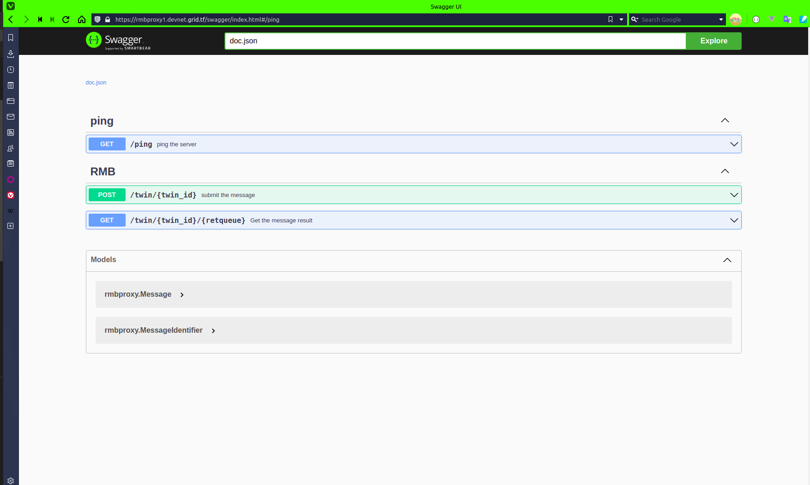

# RMB proxy server

Interact with RMB using HTTP connection

## Dependencies
- Yggdrasil is required and update its peers in `/etc/yggdrasil.conf`

  help link: [Yggdrasil](https://yggdrasil-network.github.io/installation.html)


## Server

To run `rmb_proxy` you can use the following:
```bash
rmb_proxy 
```

More options are available:
```bash
  --debug [debug|info|warn|error|fatal|panic]
  --Address [:8080]
  --substrate [substrate-http]
  --Domain [domain on which the server will be served]
  --TLSEmail [tmail address to generate certificate with]
  --CA [certificate authority used to generate certificate: https://acme-staging-v02.api.letsencrypt.org/directory]
  --CertCacheDir [path to store generated certs in: /tmp/certs]
```

## How it works
There are two endpoints:
  - `/twin/:twinid` : post request to submit message to `twinid`
  - `/twin/:twinid/:retqueue` : Get request to get the message result from `twinid`

  And also there is a swagger configured on `/swagger/index.html` 

  